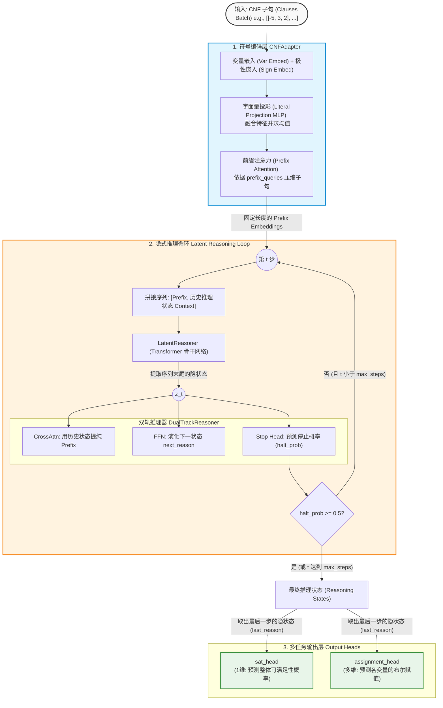

```mermaid
graph TD
    classDef inputBox fill:#f9f9f9,stroke:#333,stroke-width:2px;
    classDef adapterBox fill:#e1f5fe,stroke:#0288d1,stroke-width:2px;
    classDef loopBox fill:#fff3e0,stroke:#f57c00,stroke-width:2px;
    classDef outBox fill:#e8f5e9,stroke:#388e3c,stroke-width:2px;

    Input(["输入: CNF 子句 (Clauses Batch) e.g., [[-5, 3, 2], ...]"]):::inputBox

    subgraph CNF_Adapter [1. 符号编码层 CNFAdapter]
        direction TB
        V_S_Embed["变量嵌入 (Var Embed) + 极性嵌入 (Sign Embed)"]
        Lit_Proj["字面量投影 (Literal Projection MLP) <br/> 融合特征并求均值"]
        Pref_Attn["前缀注意力 (Prefix Attention) <br/> 依据 prefix_queries 压缩子句"]

        V_S_Embed --> Lit_Proj --> Pref_Attn
    end

    Input --> V_S_Embed

    Pref_Attn -->|"固定长度的 Prefix Embeddings"| Loop_Entry

    subgraph Reasoning_Loop [2. 隐式推理循环 Latent Reasoning Loop]
        direction TB
        Loop_Entry(("第 t 步")) --> Concat["拼接序列: [Prefix, 历史推理状态 Context]"]
        Concat --> Reasoner["LatentReasoner (Transformer 骨干网络)"]
        Reasoner -->|"提取序列末尾的隐状态"| z_t(("z_t"))

        subgraph Dual_Track [双轨推理器 DualTrackReasoner]
            direction LR
            Update_Prefix["CrossAttn: 用历史状态提纯 Prefix"]
            Update_Reason["FFN: 演化下一状态 next_reason"]
            Calc_Stop["Stop Head: 预测停止概率 (halt_prob)"]
        end

        z_t --> Update_Prefix
        z_t --> Update_Reason
        z_t --> Calc_Stop

        Calc_Stop --> Check_Halt{"halt_prob >= 0.5?"}
        Check_Halt -->|"否 (且 t 小于 max_steps)"| Loop_Entry
    end

    Check_Halt -->|"是 (或 t 达到 max_steps)"| Final_States["最终推理状态 (Reasoning States)"]

    subgraph Output_Layer [3. 多任务输出层 Output Heads]
        direction TB
        SAT_Head["sat_head<br/>(1维: 预测整体可满足性概率)"]
        Assign_Head["assignment_head<br/>(多维: 预测各变量的布尔赋值)"]
    end

    Final_States -->|"取出最后一步的隐状态 (last_reason)"| SAT_Head:::outBox
    Final_States -->|"取出最后一步的隐状态 (last_reason)"| Assign_Head:::outBox

    class CNF_Adapter adapterBox;
    class Reasoning_Loop loopBox;

```